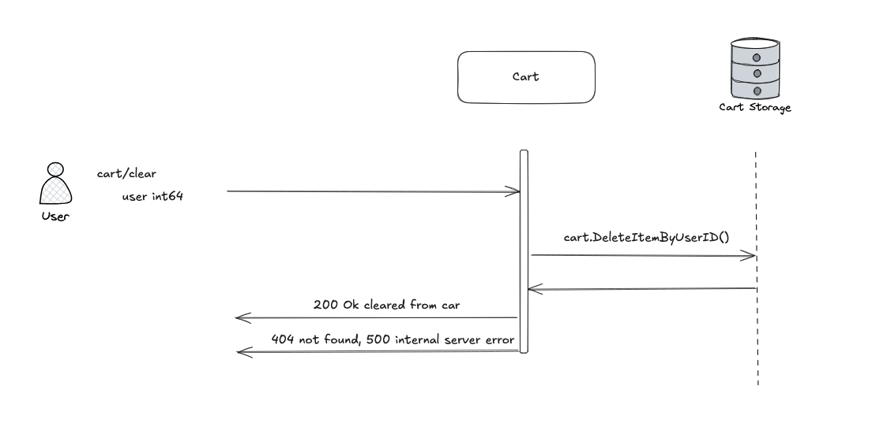
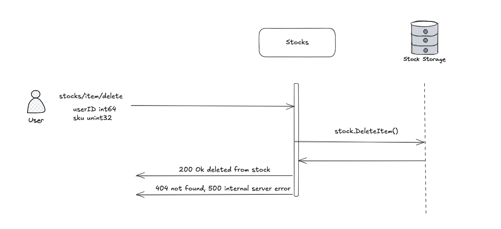
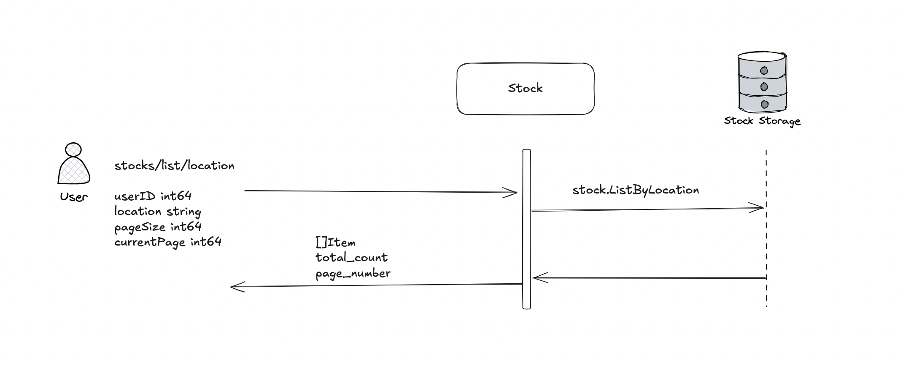
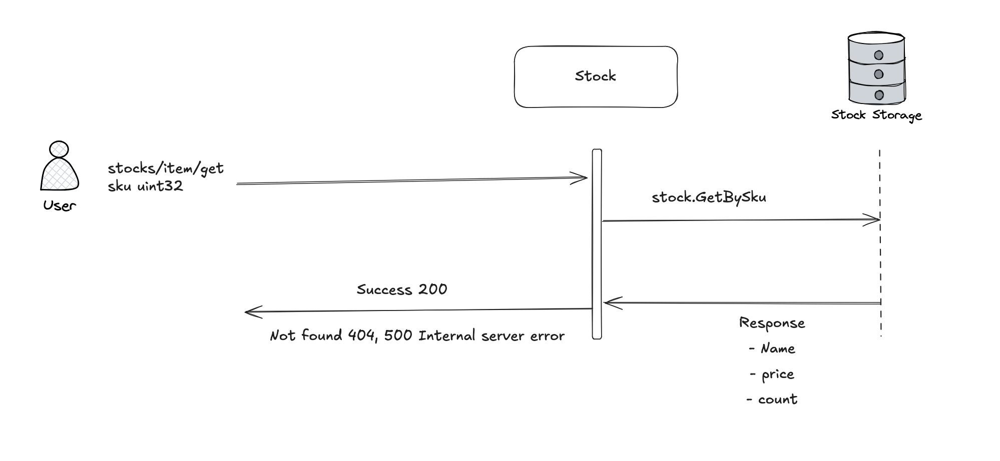

# General service architecture


# Cart Service

Manages user shopping carts.

## POST cart/item/add

Adds an item to a user's cart after stock validation.


Request
```
{
    userID int64
    sku uint32
    count uint16
}
```

Response
```
{}
```

## POST cart/item/delete

Removes an item from user's cart.


Request
```
{
    userID int64
    sku uint32
}
```

Response
```
{}
```

## POST cart/list

Lists cart contents with real-time prices from Stocks service.


Request
```
{
    userID int64
}
```

Response
```
{
    items []{
        sku uint32
        count uint16
        name string
        price uint32
    }
    totalPrice uint32
}
```

## POST cart/clear

Clears all items from user's cart.



Request
```
{
    userID int64
}
```

Response
```
{
}
```


---

# Stocks Service

Manages inventory availability, pricing, and locations.

## SKU Usage

All SKUs are predefined and must be registered in the sku table before use.

SKU IDs are assigned manually by the maintainer and follow the format: SKU### (e.g., SKU001, SKU002).

Do not create or modify SKUs on your own.

Use only existing SKUs when adding items to stock or referencing products.

```sql
CREATE TABLE sku (
    sku_id TEXT PRIMARY KEY,
    name TEXT NOT NULL UNIQUE,
    type TEXT
);

INSERT INTO sku (sku_id, name, type) VALUES
('SKU001', 't-shirt', 'apparel'),
('SKU002', 'cup', 'accessory'),
('SKU003', 'book', 'stationery'),
('SKU004', 'pen', 'stationery'),
('SKU005', 'powerbank', 'electronics'),
('SKU006', 'hoody', 'apparel'),
('SKU007', 'umbrella', 'accessory'),
('SKU008', 'socks', 'apparel'),
('SKU009', 'wallet', 'accessory'),
('SKU010', 'pink-hoody', 'apparel');

```

## POST stocks/item/add

Adds new inventory items.


Request
```
{
    userID int64
    sku uint32
    count uint16
    name string
    type string
    price  uint32
    location string

}
```

Response
```
{}
```

## POST stocks/item/delete

Removes inventory items from the stocks.



Request
```
{
    userID int64
    sku uint32
}
```

Response
```
{}
```

## POST stocks/list/location

Lists inventory in the stocks with pagination.



Request
```
{
    userID int64
    location string
    pageSize int64
    currentPage int64
}
```

Response
```
{
    items []{
        sku uint32
        count uint16
        name string
        type string
        price  uint32
        location string
    }
    
}
```

## POST stocks/item/get

Retrieves specific stock item.



Request
```
{
    sku uint32
}
```

Response
```
{
}
```


# Cart Service Operations:

- cart/item/add - Add specified quantity of an item (by SKU) to user's cart
  + Requires validation:
    + Verify item validity
    + Check available stock via Stocks service
- cart/item/delete - Remove item (by SKU) from user's cart
- cart/list - Display cart contents
  + Must retrieve in real-time:
    + Product names, prices from stocks service.
- cart/clear - Remove all items from user's cart


# Stocks Service Operations::

- stocks/item/add
  + Add new stock items to the catalog.
- stocks/item/delete
  + Remove a stock item (by SKU) from the catalog.
- stocks/list/location
  + List stock items filtered by location with pagination support.
- stocks/item/get
  + Retrieve detailed information about a specific stock item (by SKU).
    
  